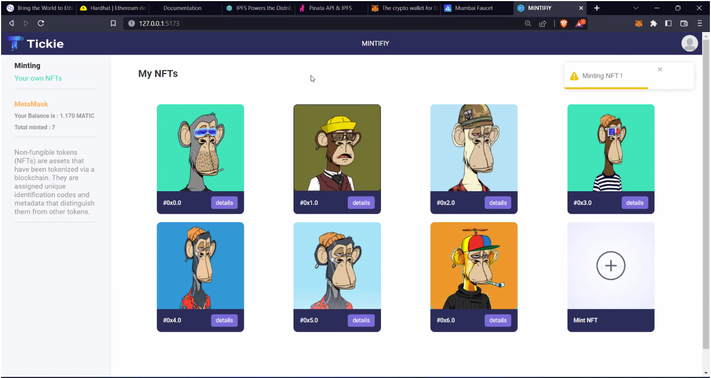

# Sample Hardhat Project

The website is a platform for NFT (Non-Fungible Token) minting, which uses the ERC-721 standard. It is built using the React framework for the front-end, with Hardhat as the development environment for building and testing smart contracts. IPFS (InterPlanetary File System) and Pinata are used for decentralized storage of digital assets, while Polygon (formerly Matic Network) provides a high-performance blockchain infrastructure for fast and affordable transactions. The website enables creators to mint their own NFTs, upload their digital assets to IPFS, and store them on Pinata. Users can also buy, sell, and trade NFTs on the platform using cryptocurrency.
Try running some of the following tasks:

 

  

